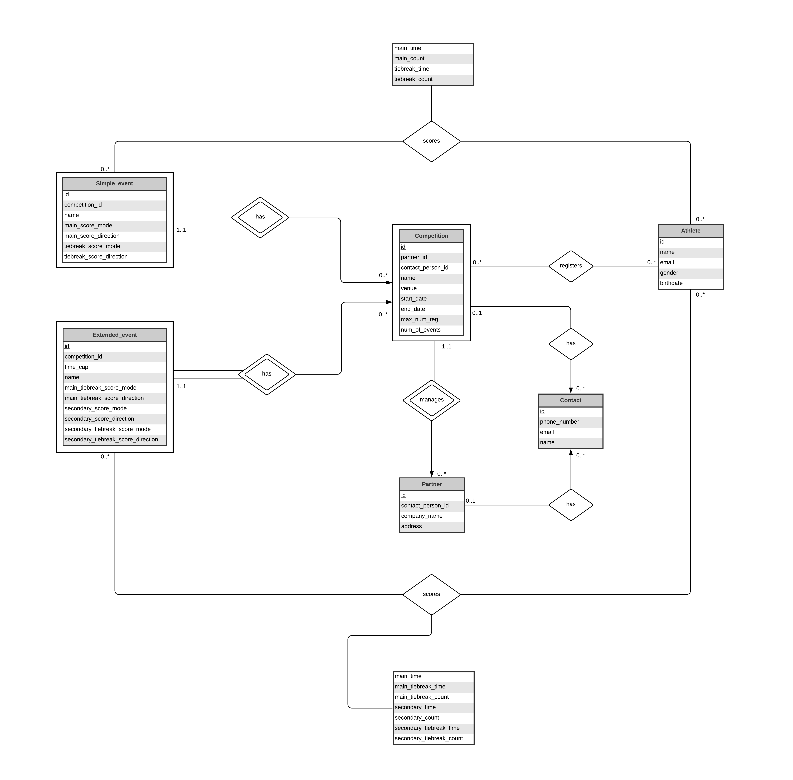
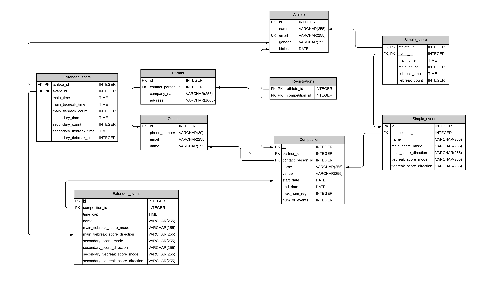

# Leaderboard

Name : Alexandru Sauer  
Student number : 300026641

## ER model :

## Schema Model :

## Running :

#### 1) Create Database ####

Create a ***PostgreSQL*** database using any sofware or interface such as *DataGrip* or *Postico*.

#### 2) Run migrations ####

Execute the migrations in order using transactions mechanism. Currently, there is only 1 migration file.
The migrations are located in the following directory : */db/Migrations*.  

#### 3) Execute Seed ####

Fill up the databse with data using the file ***seeds.sql*** found in the ***/db*** directory. Use a single transaction if possible.

